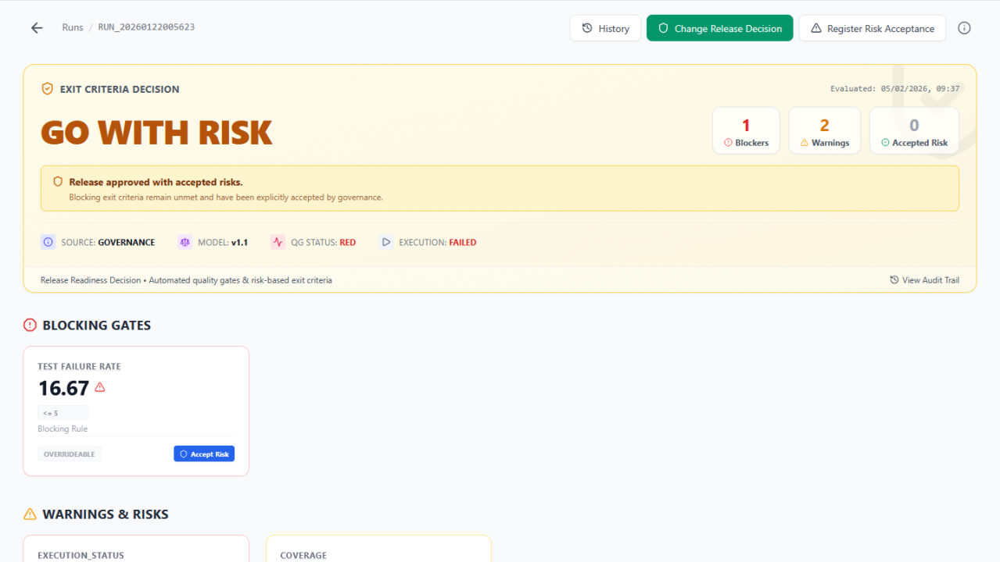

# 🧪 Behavior Annotation Model (BAM!)

> ### ⚠️ Important Notice — Community Edition (PoC)
> This edition is a **Proof of Concept (PoC)** to explore QA architectures aligned with **ISTQB**, **IEEE 29119**, and **ISO/IEC 25010**.
> It is primarily an academic / architectural demo: validating the feasibility of a **Single Source of Truth** approach for QA evidence.

  


---

> *"QA is no longer about 'checking if it works' — it is about orchestrating quality from business intent to technical evidence."*

---

## Quickstart

**Prerequisites**
- Node.js 18+
- npm

```bash
npm ci
npx playwright install --with-deps
npm test
```

Run by tags:

```bash
npm test -- --tags "@smoke"
```

Override workers:

```bash
npm test -- --parallel 2
```

---

## Purpose: Why BAM?

Traditional automation frameworks often hit structural limitations:

- **Fragility**: tests rely on selectors, repeated logic, and inconsistent flows. Imperative tests increase coupling and debt.
- **Evidence silos**: Playwright has one report, Cucumber another, k6 another… with no shared evidence standard.
- **No real traceability**: it becomes unclear:
  - which requirement each test covers,
  - which acceptance criteria were validated,
  - what data was used,
  - which component failed, and why.
- **Business/QA disconnect**: steps frequently describe *how* something is done, not *what is being validated*.

## A Single Source of Truth (for QA Evidence)

BAM is a unified ecosystem where functional, API, and performance testing share a common evidence metamodel.

That metamodel is called **BMS (Behavioral Metadata Standard)**.

> BAM does not “just run tests”: it **governs quality**.

---

## Executive Summary

This demo exists to answer three core questions a QA Lead cares about:

1. Is the suite reliable enough to support release decisions?
2. Does the architecture scale without degrading maintainability?
3. Is execution evidence sufficient for fast, traceable diagnosis?

---

## BAM Applied in This Repo

A 3-layer architecture:

| BAM Layer | Responsibility | Implementation |
| --- | --- | --- |
| **Intent** | Defines *what* behavior to validate | `features/*.feature` + `src/steps/*.ts` |
| **Design** | Exposes reusable domain flows | `src/pages/*.ts` |
| **Execution** | Encapsulates stable UI interactions and assertions | `src/components/*.ts` + `src/ux/*.ts` |

**Key design decisions**
- `HomePage` extends `BasePage` for navigation capabilities.
- `TodoPage` extends `BaseComponent` to act as an aggregate of functional components.
- Steps do **not** access the DOM directly; they only consume the domain page API.

---

## Quality Engineering Decisions

- **Scenario isolation**: each scenario creates a new `BrowserContext`.
- **Parallel-friendly execution**: browser instance is shared **per process**, while **contexts remain isolated** per scenario.
- **Zero sleeps**: no `waitForTimeout`; relies on auto-waiting and web-first assertions.
- **Centralized selectors**: `src/ux/todo.ux.ts`.
- **Real reuse**: atomic components (`Textbox`, `TodoList`, `TodoItem`, etc.).
- **Automatic evidence capture**:
  - screenshots on failure (`test-results/screenshots`)
  - traces on failure, or always when `TRACE=true` (`test-results/traces`)
  - console logs attached for failed scenarios
- **Controlled cleanup** via `@cleanup` tag.

---

## Current Functional Scope

Covered scenario (`features/todo_mvc.feature`):

1. Navigate to TodoMVC.
2. Create two tasks.
3. Complete one task.
4. Validate active task counter.
5. Reload and validate persistence.
6. Delete tasks and validate empty state.

Traceability metadata already present in the feature:
- `@ID`
- `@story`
- `@requirement`
- `@component`
- `@smoke`

---

## Example Evidence (What You’ll See After a Run)

Artifacts produced by this demo:

- `cucumber-report.html`
- `test-results/screenshots/*.png` *(failures)*
- `test-results/traces/*.zip` *(failures or `TRACE=true`)*

Open a Playwright trace zip locally:

```bash
npx playwright show-trace test-results/traces/<trace-file>.zip
```

> Note: **Canonical BMS JSON export** is planned (see Roadmap). This demo currently captures operational evidence (trace/screenshot/logs) and demonstrates the architecture and metadata flow.

---

## Project Structure

```text
features/
src/
  components/   # Atomic interactions + stable assertions
  pages/        # Domain flows (orchestration)
  steps/        # Declarative steps (intent)
  support/      # World, hooks, lifecycle
  ux/           # Centralized selectors
```

---

## Configuration

Environment variables:

| Variable | Default | Notes |
| --- | --- | --- |
| `BASE_URL` | `https://demo.playwright.dev/todomvc/` | Target URL |
| `HEADLESS` | `false` if unset | `true` recommended in CI |
| `BROWSERS` | `chromium` | supports `chromium`, `firefox`, `webkit` |
| `TRACE` | `false` if unset | `true` saves traces for all scenarios |

If `BROWSERS` is invalid, the framework falls back to `chromium`.

---


## BAM Radar (Quality Intelligence Layer)

BAM Radar is the analytics layer that turns raw execution artifacts and metadata into actionable QA intelligence: coverage and traceability views (requirements/components), quality signals and trends, and decision-ready outputs such as GO/NO-GO gates. It is designed to consume standardized evidence (e.g., BMS outputs plus traces/screenshots/logs) and produce a unified dashboard for diagnosis, risk visibility, and release governance across UI/API/performance suites.

BAM Radar is under active development and not available in this PoC. This repo focuses on the reference implementation (Intent → Design → Execution) and the metadata flow; Radar will be introduced after the evidence format is stabilized.


---

## Tool-Agnostic Runner (Playwright as Reference Implementation)

Although this demo uses Playwright for the UI runner, BAM is tool-agnostic and not coupled to any specific automation framework or programming language. The core idea is the architecture and evidence/metadata model (Intent → Design → Execution), which can be implemented with alternative stacks such as Selenium, Cypress, WebDriverIO, or even non-UI runners, without changing the governance principles

### Elements not implemented here:

- BAM Radar operational dashboard
- Canonical BMS JSON exporter
- CI/CD workflow under `.github/workflows`
- Advanced error taxonomy and ALM exporters
---

## Author

Rubén López  ruben@rulope.com  
GitHub: https://github.com/rubenlopez77  
LinkedIn: https://www.linkedin.com/in/ruben-lopez-qa/
